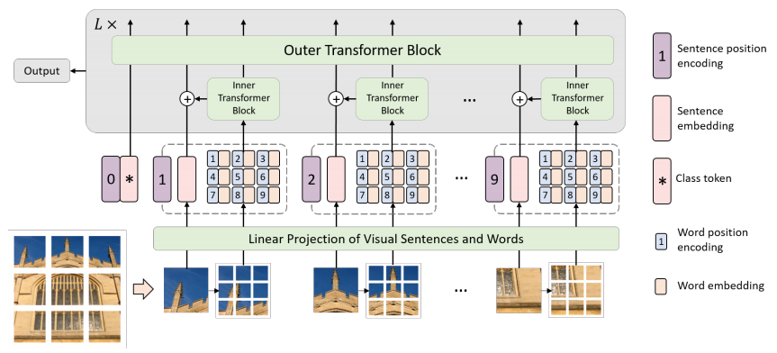
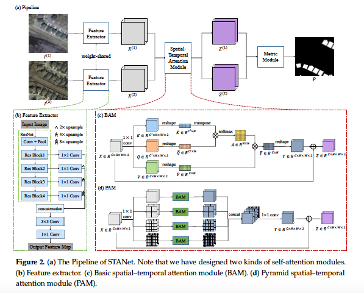
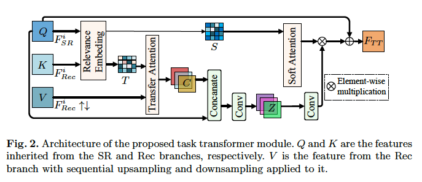
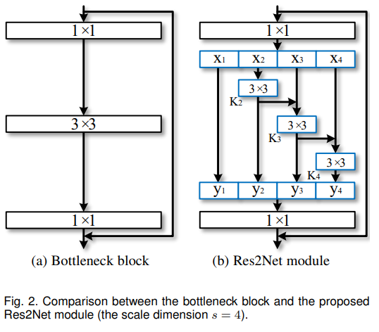
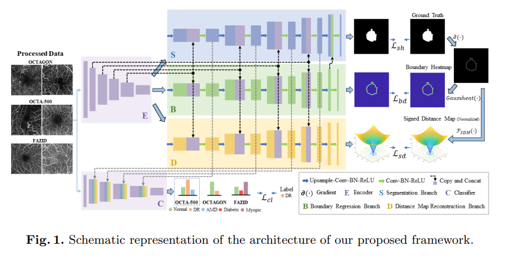
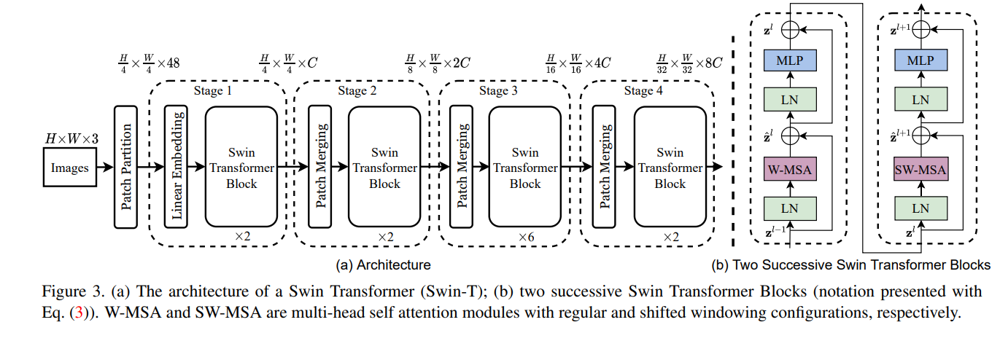

# Paper Reading

## insights

- Res2Net的想法是否可以推广至decoder，这种想法和transformer中的多头注意力机制非常相似。

- res2net and resnetxt
- CNN conv 和稍微大些的transformer相结合交替出现
- Automated detection of kinks from blood vessels for optic cup segmentation in retinal images
- Vessel Bend-Based Cup Segmentation in Retinal Images

## papers

[transformer论文研读](https://blog.csdn.net/weixin_37707670/article/details/122072975) ||
[分割研究论文](https://blog.csdn.net/weixin_37707670/article/details/122138745?spm=1001.2014.3001.5501) ||
[分类研究论文](https://blog.csdn.net/weixin_37707670/article/details/122072420?spm=1001.2014.3001.5501) ||
[医学研究论文](https://blog.csdn.net/weixin_37707670/article/details/122062425?spm=1001.2014.3001.5501) || [异常检测论文]([(77条消息) 异常检测论文更新推荐_一知半解百晓生的博客-CSDN博客](https://blog.csdn.net/weixin_37707670/article/details/122384739?spm=1001.2014.3001.5501))
## Memory

### CFLOW-AD: Real-Time Unsupervised Anomaly Detection with Localization via Conditional Normalizing Flows

***

***

### Deep High-Resolution Representation Learning for Visual Recognition

***

### Improved Transformer for High-Resolution GANs

***

## Transformer in Transformer (TNT)

***

### CS2-Net: Deep Learning Segmentation of Curvilinear Structures in Medical Imaging
Automated detection of curvilinear structures, e.g., blood vessels or nerve fibres, from medical and biomedical images is a crucial early step in automatic image interpretation associated to the management of many diseases. Precise measurement of the morphological changes of these curvilinear organ structures informs clinicians for understanding the mechanism, diagnosis, and treatment of e.g. cardiovascular, kidney, eye, lung, and neurological conditions. In this work, we propose a generic and unified convolution neural network for the segmentation of curvilinear structures and illustrate in several 2D/3D medical imaging modalities. We introduce a new curvilinear structure segmentation network (CS2-Net), which includes a self-attention mechanism in the encoder and decoder to learn rich hierarchical representations of curvilinear structures. Two types of attention modules - spatial attention and channel attention - are utilized to enhance the inter-class discrimination and intra-class responsiveness, to further integrate local features with their global dependencies and normalization, adaptively. Furthermore, to facilitate the segmentation of curvilinear structures in medical images, we employ a 1×3 and a 3×1 convolutional kernel to capture boundary features. Besides, we extend the 2D attention mechanism to 3D to enhance the network’s ability to aggregate depth information across different layers/slices. The proposed curvilinear structure segmentation network is thoroughly validated using both 2D and 3D images across six different imaging modalities. Experimental results across nine datasets show the proposed method generally outperforms other state-of-the-art algorithms in various metrics.

***

## A Spatial-Temporal Attention-Based Method and a New Dataset for Remote Sensing Image Change Detection

Abstract: Remote sensing image change detection (CD) is done to identify desired significant changes between bitemporal images. Given two co-registered images taken at different times, the illumination variations and misregistration errors overwhelm the real object changes. Exploring the relationships among different spatial–temporal pixels may improve the performances of CD methods. In our work, we propose a novel Siamese-based spatial–temporal attention neural network. In contrast to previous methods that separately encode the bitemporal images without referring to any useful spatial–temporal dependency, we design a CD self-attention mechanism to model the spatial–temporal relationships. We integrate a new CD self-attention module in the procedure of feature extraction. Our self-attention module calculates the attention weights between any two pixels at different times and positions and uses them to generate more discriminative features. Considering that the object may have different scales, we partition the image into multi-scale subregions and introduce the self-attention in each subregion. In this way, we could capture spatial–temporal
dependencies at various scales, thereby generating better representations to accommodate objects of various sizes. We also introduce a CD dataset LEVIR-CD, which is two orders of magnitude larger than other public datasets of this field. LEVIR-CD consists of a large set of bitemporal Google Earth images, with 637 image pairs (1024   1024) and over 31 k independently labeled change instances. Our proposed attention module improves the F1-score of our baseline model from 83.9 to 87.3 with acceptable computational overhead. Experimental results on a public remote sensing image CD dataset show our method outperforms several other state-of-the-art methods.

## Task Transformer Network for Joint MRI Reconstruction and Super-Resolution

Abstract. The core problem of Magnetic Resonance Imaging (MRI) is the trade o  between acceleration and image quality. Image reconstruction and super-resolution are two crucial techniques in Magnetic Resonance Imaging (MRI). Current methods are designed to perform these tasks separately, ignoring the correlations between them. In this work, we propose an end-to-end task transformer network (T2Net) for
joint MRI reconstruction and super-resolution, which allows representations and feature transmission to be shared between multiple task to achieve higher-quality, super-resolved and motion-artifacts-free images from highly undersampled and degenerated MRI data. Our framework combines both reconstruction and super-resolution, divided into two sub-branches, whose features are expressed as queries and keys. Specically, we encourage joint feature learning between the two tasks, thereby transferring accurate task information. We  rst use two separate CNN branches to extract task-speci c features. Then, a task transformer module is designed to embed and synthesize the relevance between the two tasks. Experimental results show that our multi-task model significantly outperforms advanced sequential methods, both quantitatively and qualitatively.

## ResNeSt

## Aggregated Residual Transformations for Deep Neural Networks(ResNeXt)

## Res2Net: A New Multi-scale Backbone Architecture
[知乎解析](https://www.zhihu.com/search?type=content&q=resxnet)

**Abstract**—Representing features at multiple scales is of great importance for numerous vision tasks. Recent advances in backbone convolutional neural networks (CNNs) continually demonstrate stronger multi-scale representation ability, leading to consistent performance gains on a wide range of applications. However, most existing methods represent the multi-scale features in a layer wise manner. In this paper, we propose a novel building block for CNNs, namely Res2Net, by constructing hierarchical residual-like connections within one single residual block. The Res2Net represents multi-scale features at a granular level and increases the range of receptive fields for each network layer. The proposed Res2Net block can be plugged into the state-of-the-art backbone CNN models, e.g., ResNet, ResNeXt, and DLA. We evaluate the Res2Net block on all these models and demonstrate consistent performance gains over baseline models on widely-used datasets, e.g., CIFAR-100 and ImageNet. Further ablation studies and experimental results on representative computer vision tasks, i.e., object detection, class activation mapping, and salient object detection, further verify the superiority of the Res2Net over the state-of-the-art baseline methods. The source code and trained models are available on https://mmcheng.net/res2net/.

## BSDA-Net: A Boundary Shape and Distance Aware Joint Learning Framework for Segmenting and Classifying OCTA Images

**Abstract.** Optical coherence tomography angiography (OCTA) is a novel non-invasive imaging technique that allows visualizations of vasculature and foveal avascular zone (FAZ) across retinal layers. Clinical researches suggest that the morphology and contour irregularity of FAZ are important biomarkers of various ocular pathologies. Therefore, precise segmentation of FAZ has great clinical interest. Also, there is no existing research reporting that FAZ features can improve the performance of deep diagnostic classification networks. In this paper, we propose a novel multi-level boundary shape and distance aware joint learning framework, named BSDA-Net, for FAZ segmentation and diagnostic classification from OCTA images. Two auxiliary branches, namely boundary heatmap regression and signed distance map reconstruction branches, are constructed in addition to the segmentation branch to improve the segmentation performance, resulting in more accurate FAZ contours and fewer outliers. Moreover, both low-level and high-level features from the aforementioned three branches, including shape, size, boundary, and signed directional distance map of FAZ, are fused hierarchically with features from the diagnostic classifier. Through extensive experiments, the proposed BSDA-Net is found to yield state-of-the-art segmentation and classification results on the OCTA-500, OCTAGON, and FAZID datasets.

## Swin Transformer: Hierarchical Vision Transformer using Shifted Windows

- [ ] What is the difference between Patch Partition and Patch Merging ?
- [ ] How is the shift window implemented ?
- [ ] Masked mask is 0 or not? Why?
